# ani-tracker

[](#project-status)
[](docker-compose.yml)
[](LICENSE)

ani-tracker is a local-first tracker for anime episodes. It can also be used to
track TV shows and movies.

ani-tracker is designed as a self-hostable alternative to
[TV Time](https://tvtime.com/). Its interaction model is
inspired by TV Time and Apple Music.

ani-tracker's user interface uses a unified design language, *Twilight Iris*,
that aims to feel calm, precise, respectful of the media content, and personal.
Inspired by TV Time and physical movie tickets, ani-tracker designs a
ticket-stub style swipe interaction for watching episodes. All user
interactions closely follow the
[Apple Human Interface Guidelines](https://developer.apple.com/design/human-interface-guidelines/)
to give users the best possible experience and visual feel. For more about the
design, see [Design Style](docs/design_style.md).

## Documentation

- [中文 README](docs/README.zh-CN.md)

## Screenshots

### Desktop

| Login | Search | Library |
| --- | --- | --- |
| 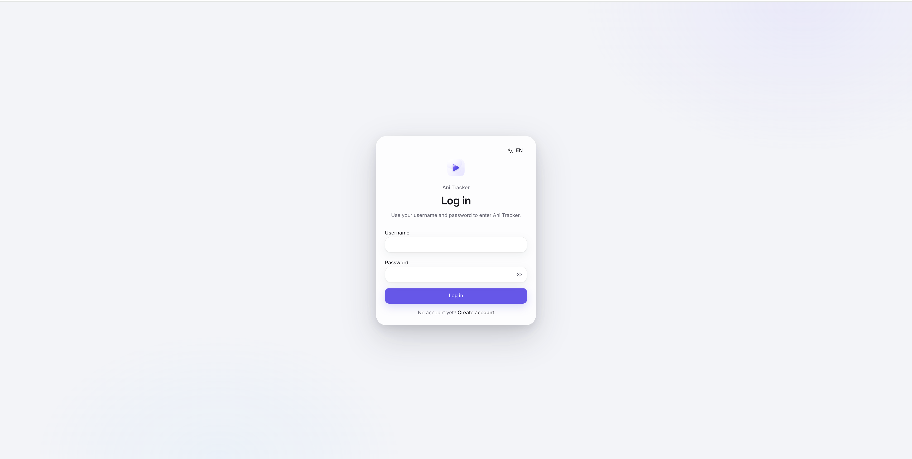 | 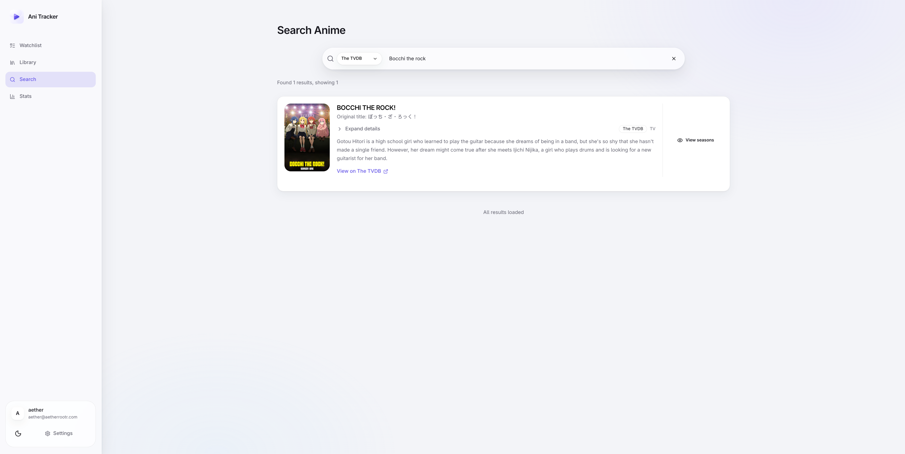 | 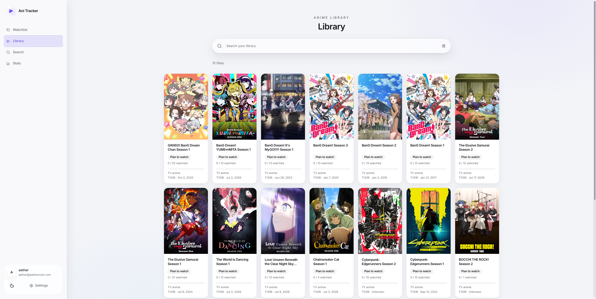 |

| Watchlist | Stats | Select TVDB season |
| --- | --- | --- |
|  | 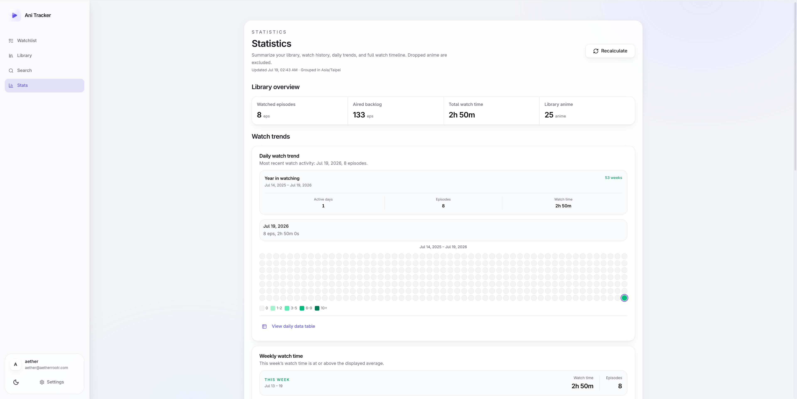 | 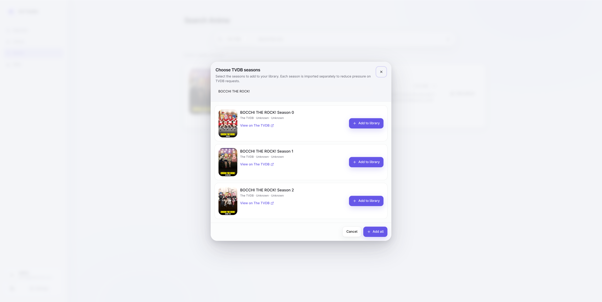 |

<details>
<summary>View dark mode screenshots</summary>

| Login | Search | Library |
| --- | --- | --- |
| 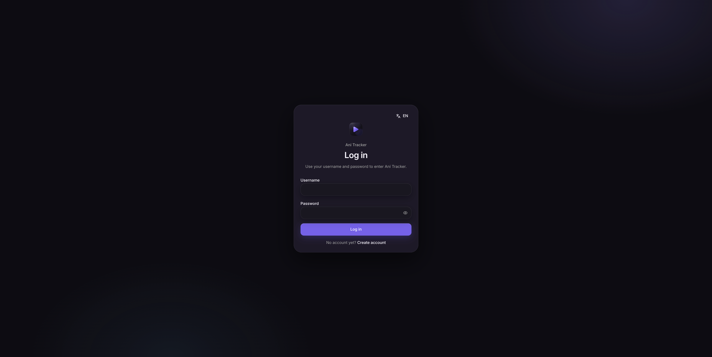 | 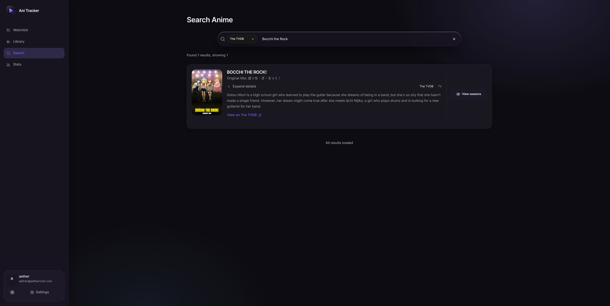 | 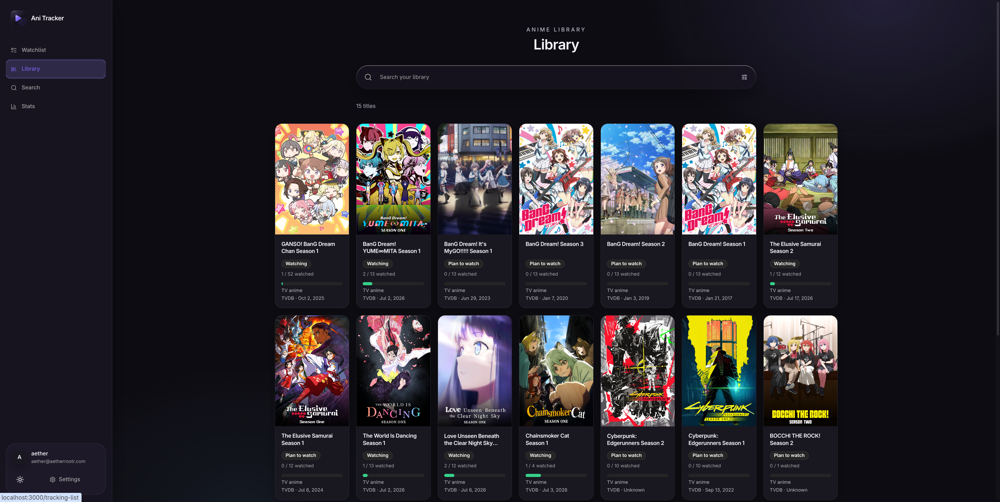 |

| Watchlist | Stats |
| --- | --- |
| 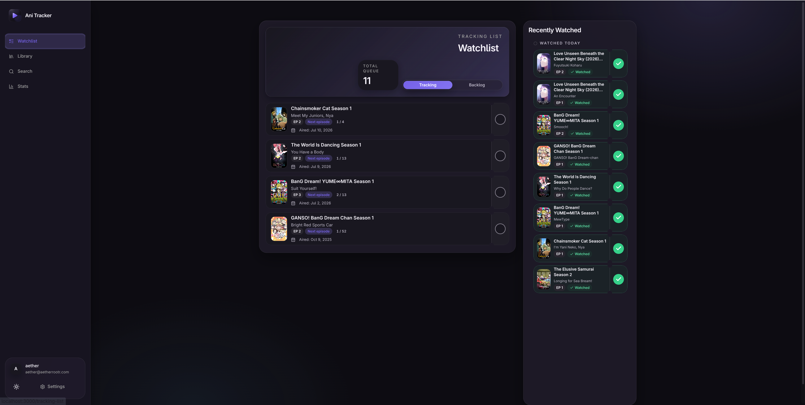 | 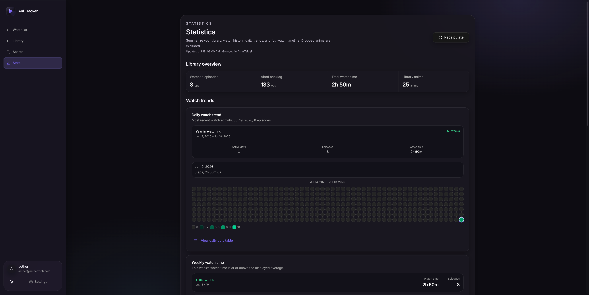 |

</details>

### Mobile

<details>
<summary>View mobile screenshots</summary>
<p>
  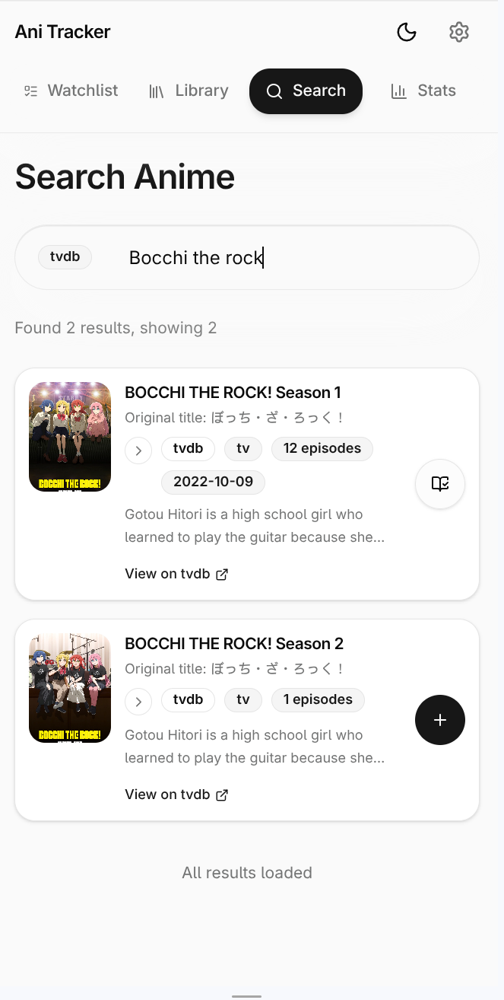
  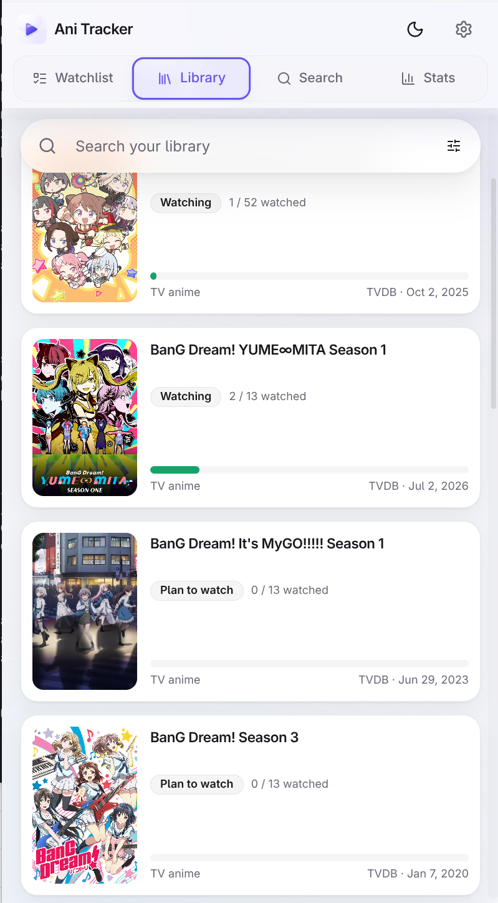
  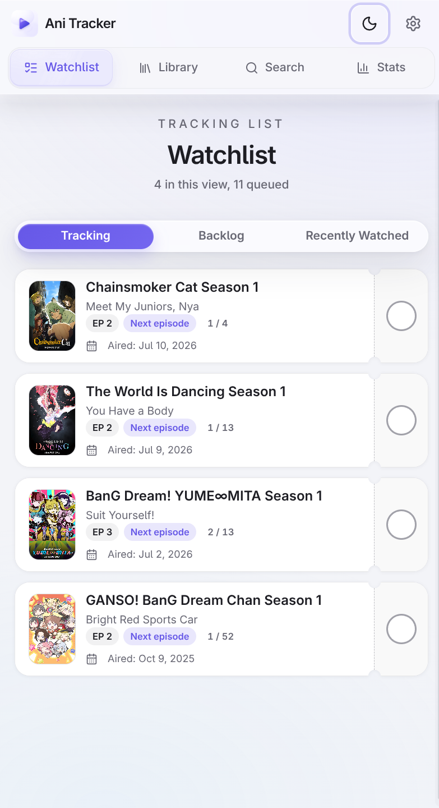
  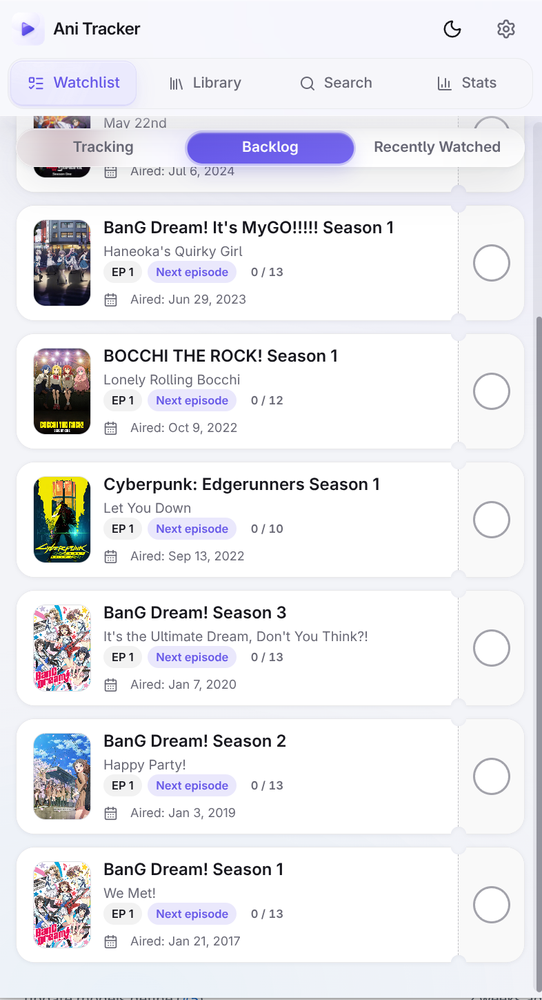
  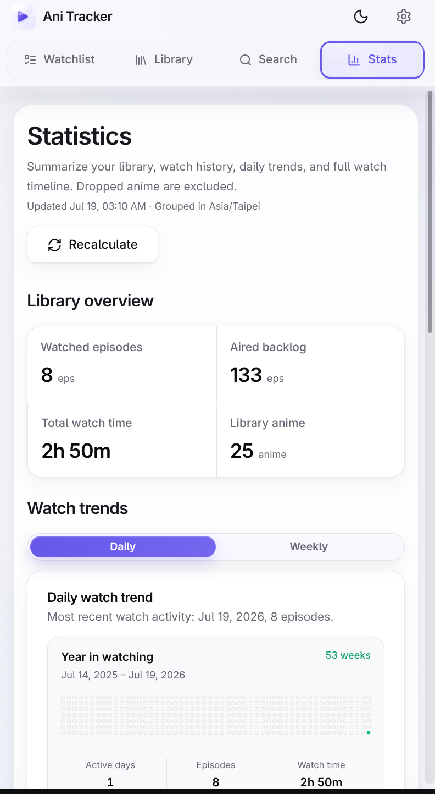
</p>
</details>

## Project Status

ani-tracker is in early development. Core tracking features are usable, but APIs,
migrations, UI details, and metadata-provider behavior may still change.

The project is developed with the help of AI-assisted tools. Architecture
design, feature decisions, code review, and final merges are all handled by the
maintainer. The project uses Ruff, mypy, and pytest for static checks and
automated testing.

## Features

- **Self-hosted first:** accounts, watch records, and your personal library are
  stored in a database controlled by the deployer.
- **Multiple metadata providers:** supports [Bangumi](https://bangumi.tv/),
  [TheTVDB](https://www.thetvdb.com/), and [TMDB](https://www.themoviedb.org/).
- **Explicit data provenance:** each title is linked to a single metadata
  provider at a time, avoiding silently mixing data from different sources.
- **Local metadata snapshots:** freeze the current title and episode structure
  to reduce the impact of upstream data changes.
- **Responsive interactions:** operation flows are optimized separately for
  desktop and mobile.
- **Unified authentication:** supports optional OIDC / SSO integration.
- **Automatic updates:** discovers and imports new episodes, new seasons, and
  related anime from upstream.
- **Custom branding:** supports replacing the logo, favicon, PWA icons, and app
  background.
- **Multi-user support:** Each user has their own data space, with no interference between them.

## Quick Start

Run the full production stack with Docker Compose:

```bash
cp env.example .env
docker compose up --build
```

The compose stack starts the web application, a Celery worker, PostgreSQL, and
Redis. The app is exposed at `http://localhost:8080` by default. Change
`APP_PORT` in `.env` if you want to use another port.

## Metadata Providers

| Provider | Status | Notes |
| --- | --- | --- |
| [Bangumi](https://bangumi.tv/) | Supported | Anime-focused metadata |
| [TheTVDB](https://www.thetvdb.com/) | Supported | TV metadata |
| [TMDB](https://www.themoviedb.org/) | Partial Supported | TV and movie metadata |

Using TheTVDB data requires a TheTVDB subscription. Subscribe at
[TheTVDB Subscribe](https://www.thetvdb.com/subscribe) to obtain an API PIN for
TheTVDB API access. TheTVDB-backed features, including importing data from
TV Time, require a valid API PIN. ani-tracker does not provide a TheTVDB API PIN.

## Configuration

Copy `env.example` to `.env` before running Docker Compose. Common settings:

| Variable | Description |
| --- | --- |
| `APP_PORT` | Public HTTP port. Defaults to `8080`. |
| `SECRET_KEY` | Flask session secret. Change this before deployment. |
| `POSTGRES_DB` | PostgreSQL database name. |
| `POSTGRES_USER` | PostgreSQL username. |
| `POSTGRES_PASSWORD` | PostgreSQL password. Change this before deployment. |
| `ANIME_TRACKER_INSTANCE_PATH` | Persistent app instance directory. Defaults to `/var/lib/ani-tracker` in production containers. |
| `TMDB_API_KEY` | Optional TMDB API key. |
| `TMDB_ACCESS_TOKEN` | Optional TMDB access token. |
| `TVDB_API_KEY` | Optional TheTVDB API key. TheTVDB-backed features also require a user-provided API PIN. |
| `TVDB_API_PIN` | Optional TheTVDB API PIN. Obtain it from a TheTVDB subscription; ani-tracker does not provide one. |
| `ANIME_SYNC_CRON_HOUR` | Comma-separated hours for airing anime synchronization. Defaults to `4,12,20`. |
| `ANIME_SYNC_CRON_MINUTE` | Minute for airing anime synchronization. Defaults to `0`. |
| `UNTRACKED_ANIME_CLEANUP_DISABLED` | Disables the scheduled `delete_untracked_anime` cleanup when set to `true`. Defaults to `true`. |
| `AUTO_IMPORT_TVDB_SEASONS_ENABLED` | Automatically import discovered TVDB seasons for eligible user-library entries. |
| `AUTO_IMPORT_BANGUMI_RELATED_ANIME_ENABLED` | Automatically import conservative Bangumi related anime (`续集`/`前传`) for eligible user-library entries. |
| `OIDC_ENABLED` | Enables optional OIDC / SSO integration. |

## Non-goals

- ani-tracker does not manage local media files.
- ani-tracker is not a download, streaming, or media-server application.
- ani-tracker does not aim to be a social network.

## Known Limitations

- Metadata-provider behavior may change during early development.
- Switching metadata providers is best-effort. Unmatched historical episode
  watch records are not actively deleted, but only local snapshots are intended
  to preserve an old episode view for future use.
- Some UI interactions may be refined in future releases.

## Roadmap

- [x] TV Time data import
- [ ] Data export
- [x] Support custom background images to improve the frontend experience
- [ ] AniList as a metadata provider
- [ ] Configure streaming platforms and external playback links for titles

## Custom Branding

See [Custom Branding](docs/branding.md).

## Development

See [Development](docs/development.md).

## Reset a user's password

Reset a user's password by username from inside the container:

```bash
ani-tracker reset-password <username>
```

This sets a random 12-character password and prints it to stdout.

## Contributing

Issues and discussions are welcome. The project is still evolving, so please open
an issue before starting large changes.

## License

ani-tracker is licensed under the [Apache License 2.0](LICENSE).

## Compliance

ani-tracker is a self-hosted tracking tool for recording watch progress and
managing a personal library. It does not provide downloading, streaming
playback, media-server features, or local media-file management.

Metadata such as titles, episode information, images, and descriptions may come
from third-party services including Bangumi, TheTVDB, and TMDB. Deployers and
users are responsible for complying with applicable laws, third-party API terms,
licensing requirements, data-processing requirements, and privacy obligations in
their jurisdiction.
